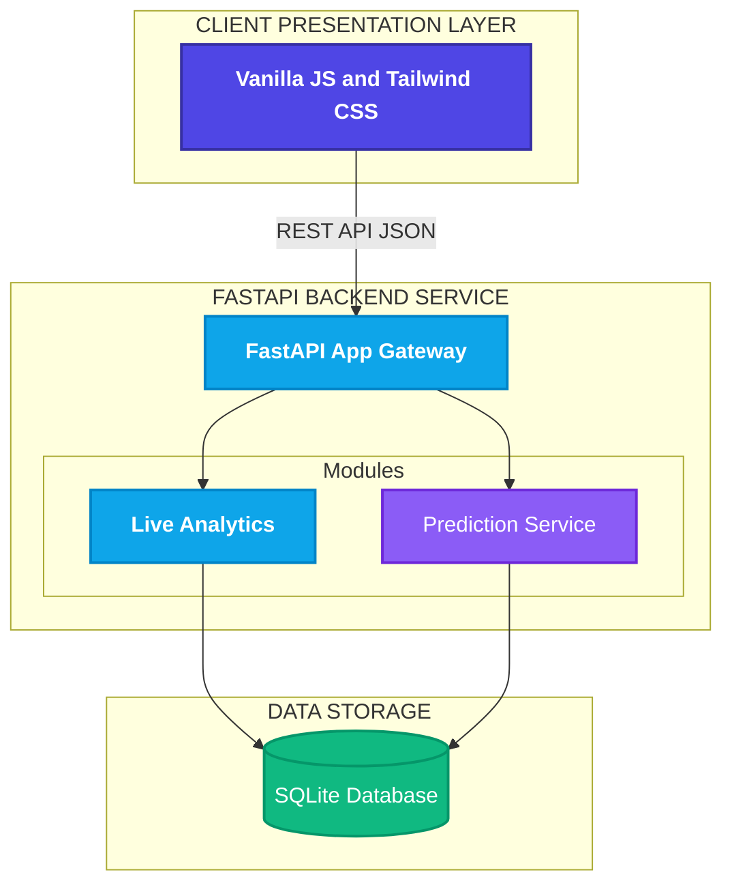
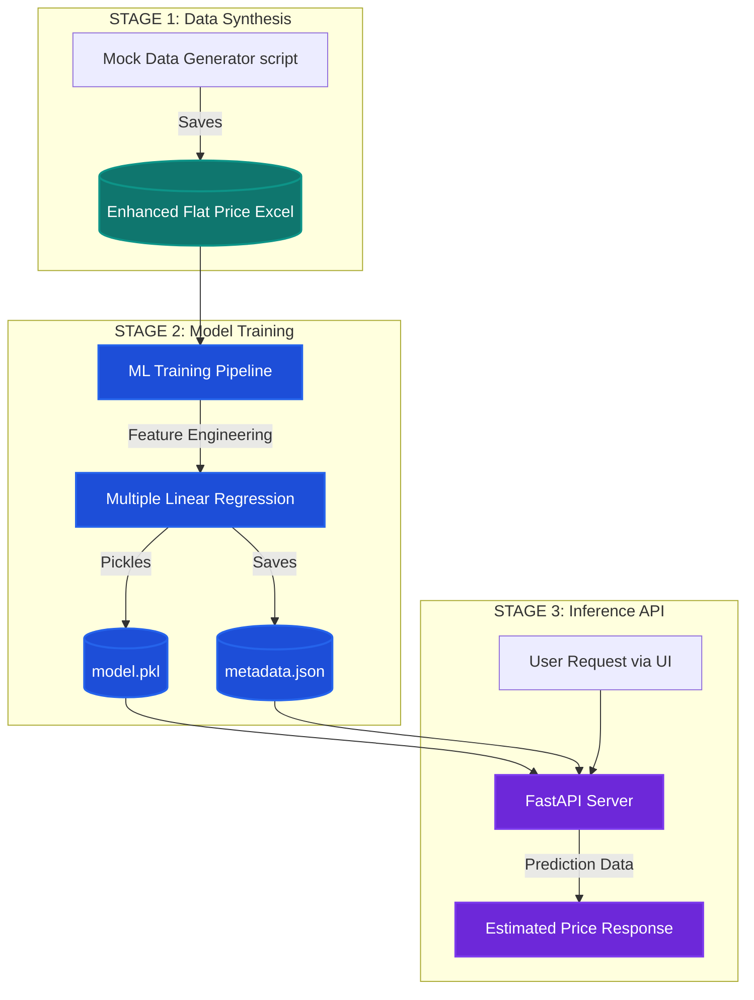

# 🏡 PricePredict Pro

> **Intelligent Real Estate Valuation & Market Analytics Platform**

[](https://fastapi.tiangolo.com)
[](https://python.org)
[](https://tailwindcss.com)
[](https://scikit-learn.org)
[](https://sqlite.org)
[](https://leafletjs.com)

---

PricePredict Pro is a highly-interactive, full-stack web application that leverages machine learning to predict house prices across various cities in India. Designed with a sleek **Glassmorphism UI** and powered by a blazing-fast **FastAPI backend**, it integrates interactive map visualizations, predictive ML modeling, and live usage analytics into a single cohesive platform.

---

## 📋 Table of Contents

- [✨ Features](#-features)
- [🏗️ Architecture & Pipeline](#️-architecture--pipeline)
  - [System Architecture](#system-architecture)
  - [Machine Learning Pipeline](#machine-learning-pipeline)
- [🛠️ Tech Stack](#️-tech-stack)
- [📁 Project Structure](#-project-structure)
- [💻 Local Development Setup](#-local-development-setup)
- [📝 License](#-license)

---

## ✨ Features

| Feature | Details |
|---|---|
| 🗺️ **Interactive Geographic Map** | Dynamic Leaflet.js integration. Click on any major Indian city (Mumbai, Bengaluru, Delhi, etc.) to instantly fly to that location via satellite view. |
| 🔮 **ML-Powered Predictions** | Uses a Multiple Linear Regression (MLR) model built with Scikit-learn to estimate precise property values based on over 10 distinct features. |
| 📊 **Live Usage Analytics** | Real-time backend tracking using SQLite that displays live usage stats including "Total Predictions Made Today" and "Trending Search Areas" via an animated 3D flip-card. |
| 🎨 **Premium UI/UX Design** | Built entirely with Vanilla JS and Tailwind CSS. Features glowing hover states, fluid CSS transitions, animated numbers, and sleek dark-mode glassmorphism. |
| ⚡ **Unified Architecture** | FastAPI seamlessly serves both the REST API for model inference and the static frontend UI, drastically simplifying deployment. |

---

## 🏗️ Architecture & Pipeline

### System Architecture



### Machine Learning Pipeline



---

## 🛠️ Tech Stack

| Component | Stack | Purpose |
|---|---|---|
| **Runtime & Framework** | Python 3.11+, FastAPI | High-performance asynchronous REST API framework serving the frontend and API |
| **Frontend UI** | HTML5, CSS3, TailwindCSS | Styling, responsiveness, and glassmorphism interface |
| **Mapping Engine** | Leaflet.js | Rendering interactive satellite tiles and managing map state |
| **Machine Learning** | Scikit-Learn, Pandas | Training the MLR model and handling feature scaling/encoding |
| **Database** | SQLite, SQLAlchemy | Storing search logs for real-time Live Usage Analytics |

---

## 📁 Project Structure

```text
PricePredict-Pro/
├── app/
│   ├── api/
│   │   └── routes.py          # FastAPI endpoints (/predict, /analytics)
│   ├── db/
│   │   ├── database.py        # SQLAlchemy engine and session
│   │   └── models.py          # SQLite database schemas
│   ├── schemas/
│   │   └── property.py        # Pydantic data validation models
│   ├── services/
│   │   └── ml_service.py      # ML Model loading and inference logic
│   ├── artifacts/
│   │   ├── model.pkl          # Serialized MLR model
│   │   └── metadata.json      # Model feature mapping metadata
│   └── main.py                # FastAPI application entry point
├── frontend/
│   ├── css/
│   │   └── style.css          # Tailwind overrides and custom animations
│   ├── js/
│   │   └── script.js          # DOM manipulation and API integration
│   └── index.html             # Main dashboard UI
└── ml_pipeline/
    ├── generate_mock_data.py  # Script to generate synthetic dataset
    ├── train_model.py         # Script to train and save the ML model
    └── Enhanced_Flat_Price.xlsx # Generated training dataset
```

---

## 💻 Local Development Setup

### 1. Clone the Repository
```bash
git clone https://github.com/8ernity/PricePredict-Pro.git
cd PricePredict-Pro
```

### 2. Setup the Environment
Create a virtual environment and install dependencies:
```bash
python -m venv venv

# On Windows:
venv\Scripts\activate
# On macOS/Linux:
source venv/bin/activate

pip install -r requirements.txt
```

### 3. Start the Server
Because the architecture is unified, one command runs everything (API and Frontend):
```bash
uvicorn app.main:app --reload
```
The application will be live at `http://127.0.0.1:8000`.

### 4. Run the ML Pipeline (Optional)
If you want to tweak the features or re-train the model:
```bash
cd ml_pipeline
python generate_mock_data.py
python train_model.py
```

---

## 📝 License

This project is open-source and available under the MIT License.
